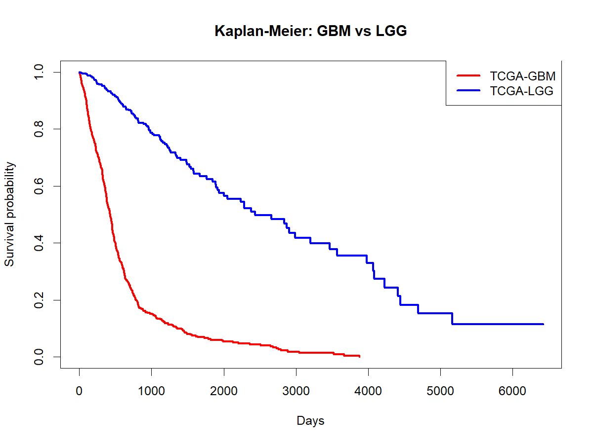
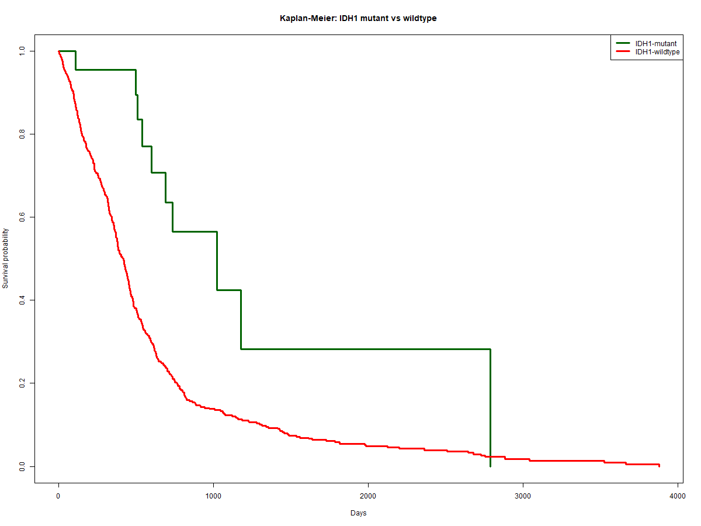
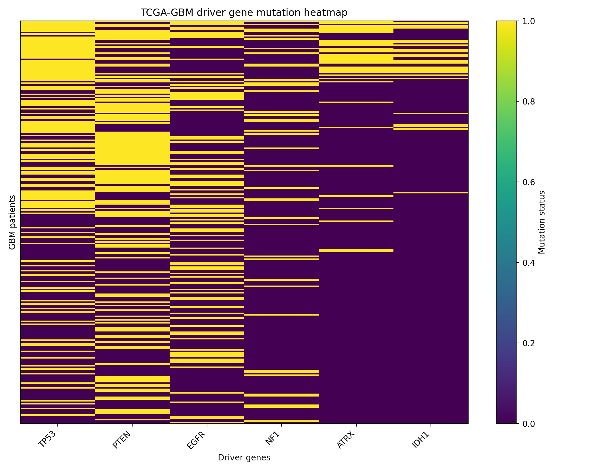

# Glioma Multi-Omics Landscape

Topology-informed multi-omics analysis of human gliomas using TCGA data.

## Research Question

Can molecular and clinical data identify glioma subgroups associated with patient survival?

## Datasets

- TCGA-GBM (Glioblastoma)
- TCGA-LGG (Lower Grade Glioma)

## Data Types

- Clinical data
- Survival data
- Somatic mutations (MAF)
- RNA-seq (planned)

## Methods

### Clinical Survival Analysis

- Kaplan-Meier survival analysis
- GBM vs LGG comparison
- IDH1-mutant vs IDH1-wildtype comparison

### Mutation Analysis

- TCGA mutation download using TCGAbiolinks
- Driver gene analysis
- Mutation frequency analysis
- Mutation heatmap generation

### Planned Analyses

- Differential expression analysis
- Pathway enrichment
- Network analysis
- Topological data analysis

## Results

### GBM vs LGG Survival

LGG patients show substantially longer survival than GBM patients.



### IDH1 Mutation Status and Survival

Patients carrying IDH1 mutations exhibit improved overall survival.



### Driver Gene Mutation Landscape

Frequently altered genes in TCGA-GBM include:

| Gene | Mutation count |
|--------|--------:|
| TP53 | 175 |
| PTEN | 157 |
| EGFR | 135 |
| NF1 | 69 |
| ATRX | 52 |
| IDH1 | 26 |

### Driver Gene Heatmap



## Repository Structure

```text
config/
reports/
scripts/
results/
figures/
Snakefile
README.md
```

## Technologies

- Python
- R
- TCGAbiolinks
- pandas
- matplotlib
- survival
- Snakemake

## Author

Agata Gabara
