# Glioma Multi-Omics Landscape

This project presents an integrated multi-omics analysis of glioma using TCGA GBM and LGG datasets. The analysis combines somatic mutation profiling, survival analysis, differential gene expression, and integrative visualization to compare the molecular landscape of glioblastoma (GBM) and lower-grade glioma (LGG).

---

## Project Overview

Gliomas are heterogeneous brain tumors with distinct molecular and clinical profiles. In this project, I analyzed TCGA glioma data to identify differences between GBM and LGG at the genomic, transcriptomic, and clinical levels.

The workflow includes:

- somatic mutation analysis
- driver gene comparison
- co-mutation and mutual exclusivity analysis
- survival analysis
- differential expression analysis
- multi-omics visualization

---

## Workflow

```text
TCGA Data
│
├── Mutation Analysis
│   ├── GBM and LGG oncoplots
│   ├── Mutation burden analysis
│   ├── Waterfall plot
│   ├── Lollipop plots
│   ├── Rainfall plot
│   └── Ti/Tv analysis
│
├── Survival Analysis
│   ├── GBM vs LGG Kaplan-Meier curve
│   └── IDH1 mutant vs wildtype Kaplan-Meier curve
│
├── Differential Expression Analysis
│   ├── DESeq2 analysis
│   ├── Volcano plot
│   ├── Top DE genes barplot
│   └── Heatmap of top variable genes
│
└── Multi-Omics Integration
    ├── Co-oncoplot
    ├── Mutual exclusivity matrix
    ├── Chord diagram
    ├── Sankey diagram
    ├── Alluvial plot
    └── Molecular evolution tree
````

---

## Key Findings

* LGG tumors were strongly enriched for **IDH1 mutations**.
* GBM tumors showed frequent alterations in **PTEN**, **TP53**, and **EGFR**.
* LGG patients showed substantially longer overall survival than GBM patients.
* IDH1-mutant tumors were associated with improved survival compared with IDH1-wildtype tumors.
* EGFR and IDH1 showed a mutually exclusive mutation pattern.
* ATRX and TP53 showed strong co-occurrence in LGG.
* Differential expression analysis revealed extensive transcriptomic differences between GBM and LGG.

---

## Main Results

### 1. Mutation Landscape

Somatic mutation analysis showed distinct driver mutation profiles between GBM and LGG. GBM was characterized by frequent alterations in **PTEN**, **TP53**, and **EGFR**, whereas LGG was dominated by **IDH1**, **TP53**, and **ATRX** mutations.

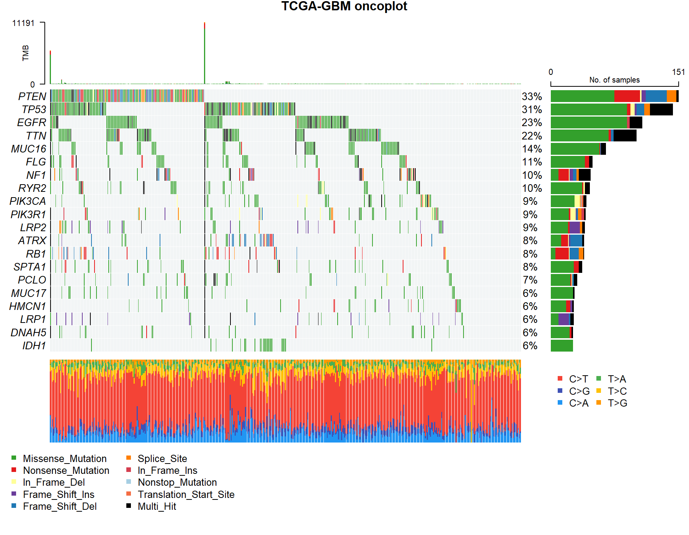

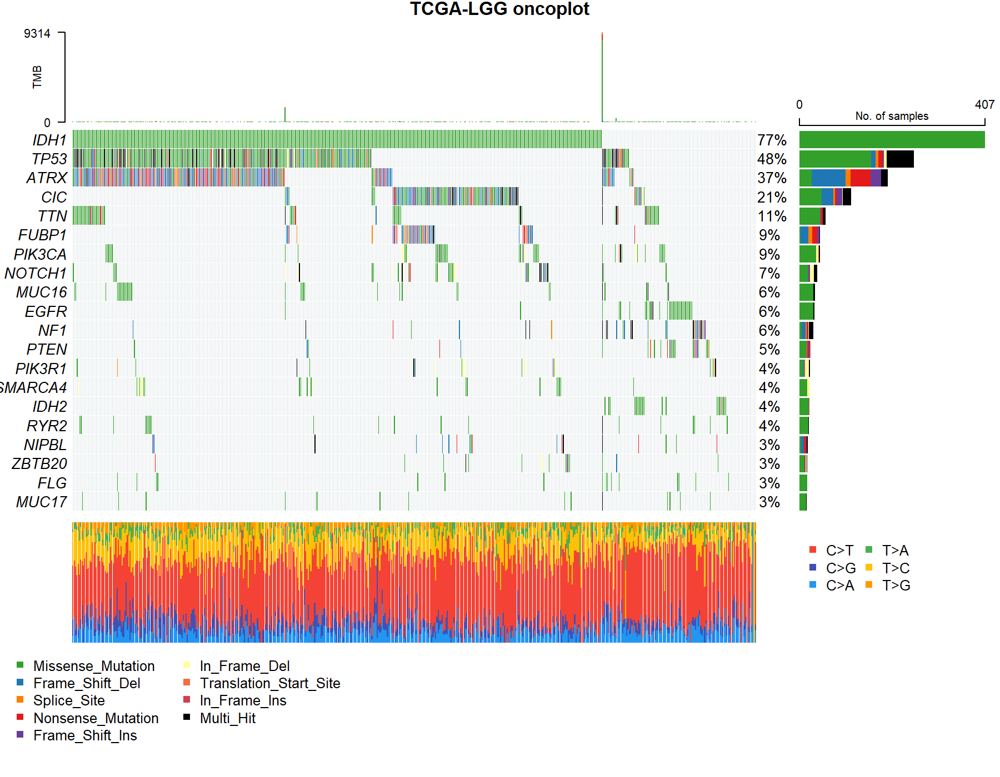

---

### 2. Comparative Driver-Gene Landscape

The co-oncoplot highlights subtype-specific mutation patterns. GBM shows enrichment of EGFR/PTEN-related alterations, while LGG shows enrichment of IDH1/TP53/ATRX/CIC/FUBP1 alterations.

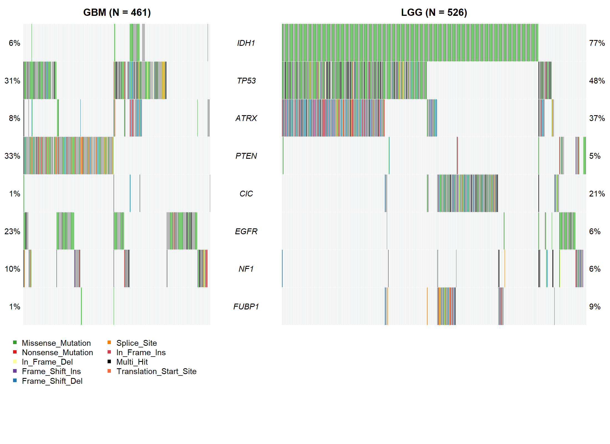

---

### 3. Survival Analysis

Kaplan-Meier analysis demonstrated clear survival differences between GBM and LGG. LGG patients showed markedly longer survival than GBM patients.


IDH1 mutation status was also associated with improved prognosis.


---

### 4. Mutual Exclusivity and Co-Mutation Patterns

Mutual exclusivity analysis revealed subtype-specific relationships between glioma driver genes. EGFR and IDH1 showed mutual exclusivity, while ATRX and TP53 showed strong co-occurrence.

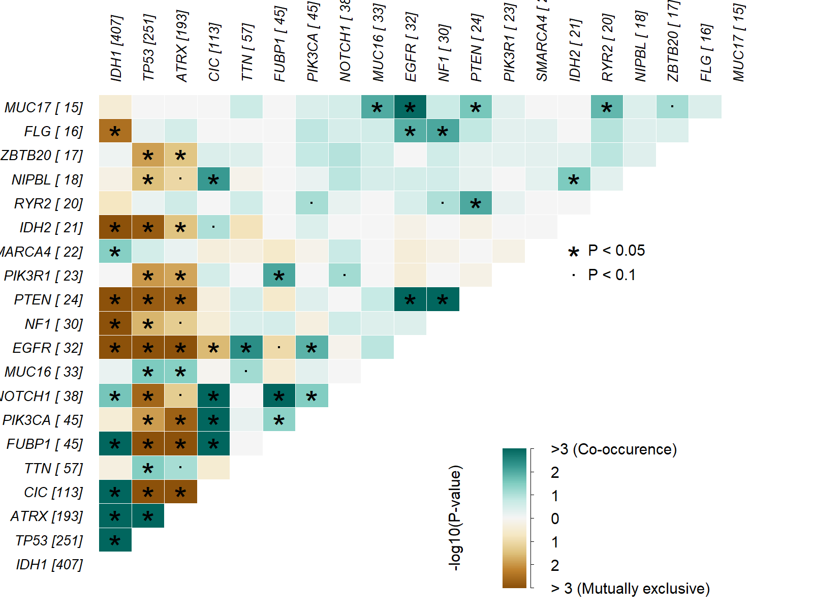

The chord diagram summarizes co-mutated driver-gene relationships.

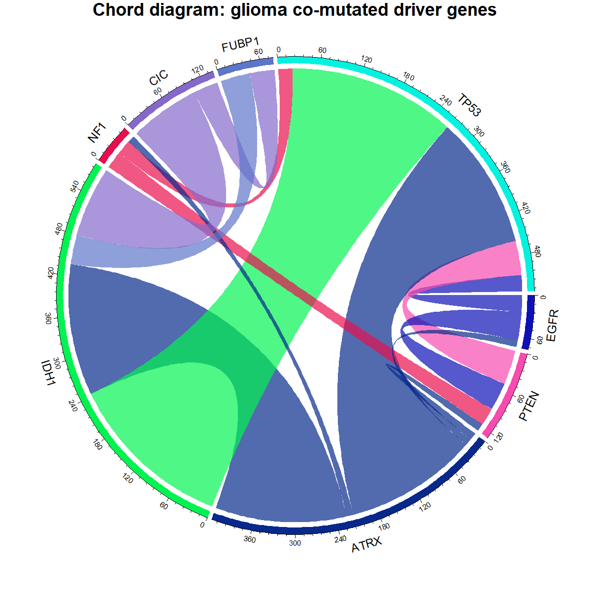

---

### 5. Differential Expression Analysis

Differential expression analysis identified widespread transcriptomic differences between GBM and LGG.

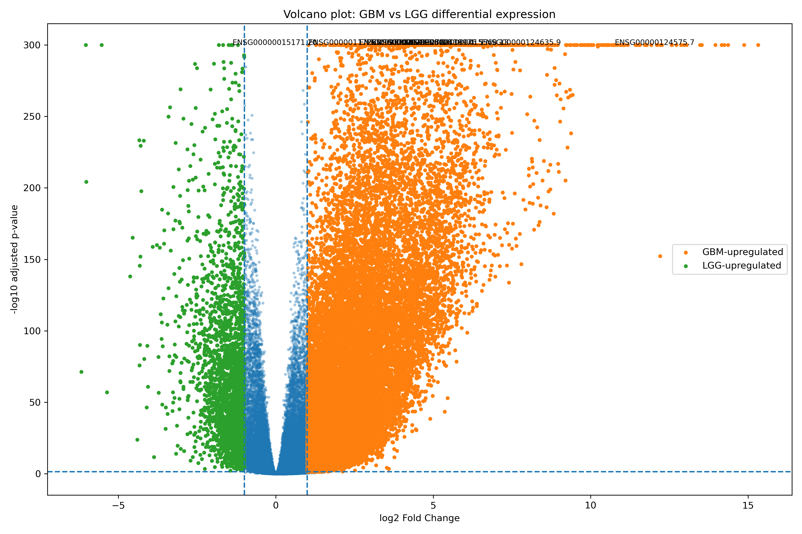

Top differentially expressed genes were visualized using a barplot.

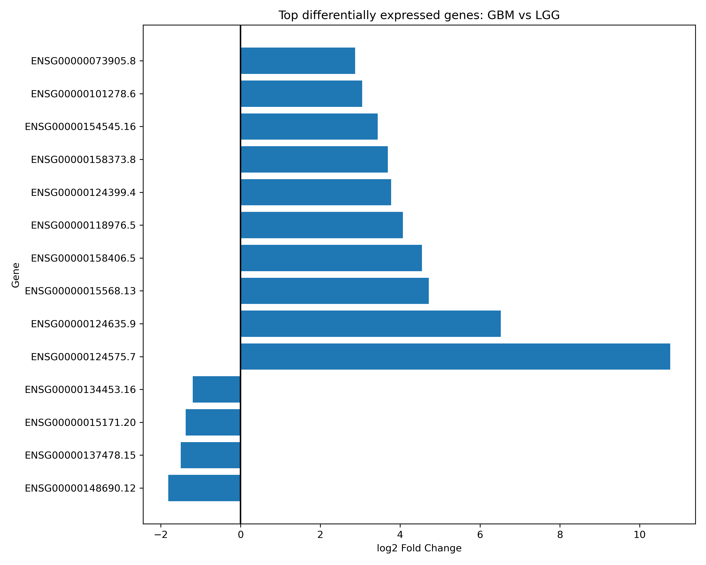

---

### 6. Tumor Heterogeneity and Mutation Burden

Mutation burden analysis revealed heterogeneous mutational profiles across GBM and LGG patients.

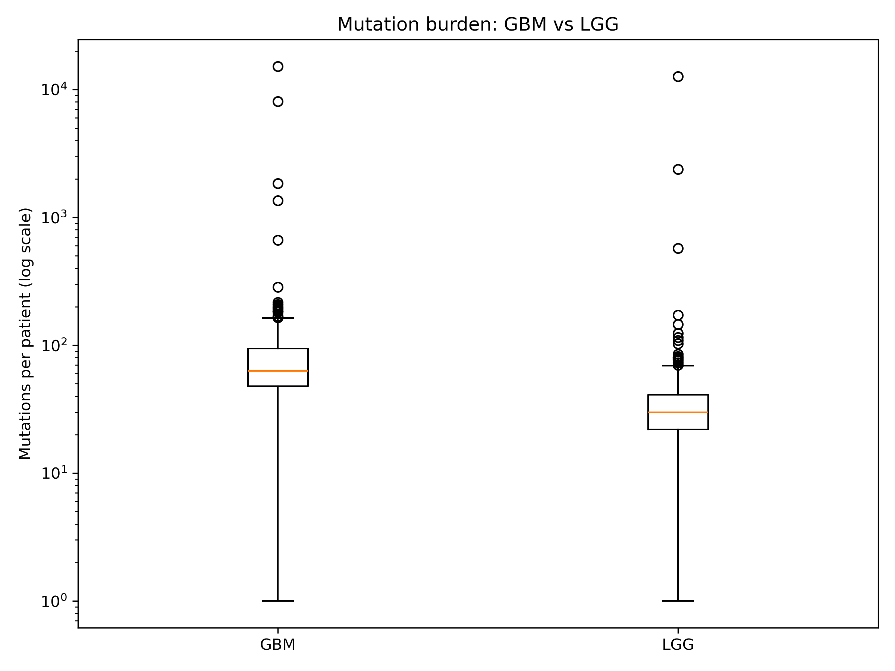

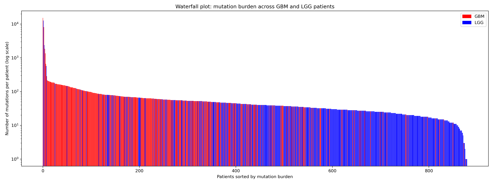

Rainfall analysis identified local mutation clustering events in GBM.

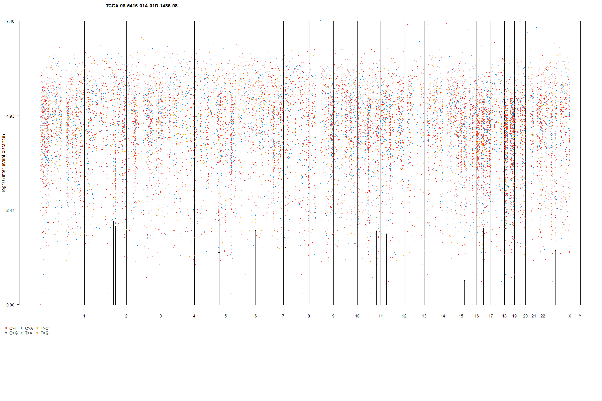

---

### 7. Driver Gene Hotspots

Lollipop plots were used to visualize mutation hotspots in key glioma driver genes.

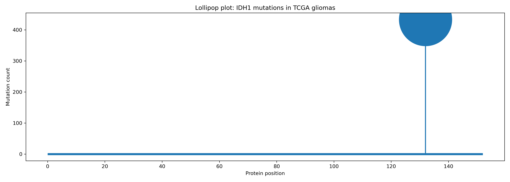

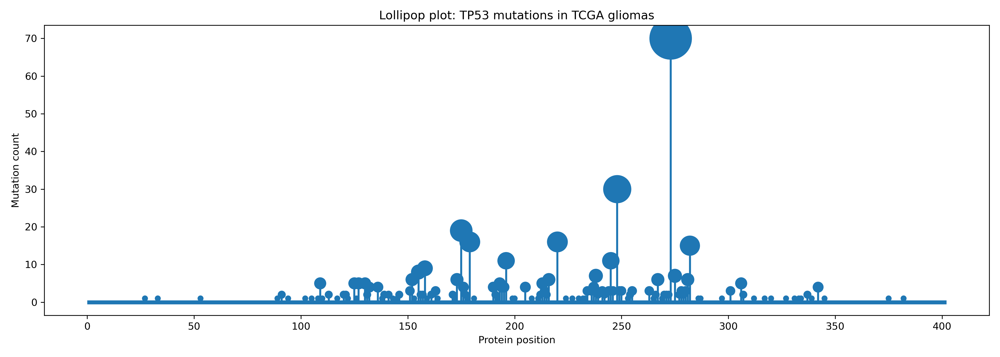

---

### 8. Multi-Omics Summary Visualizations

An alluvial plot summarizes the relationship between tumor type and driver-gene mutation profiles.

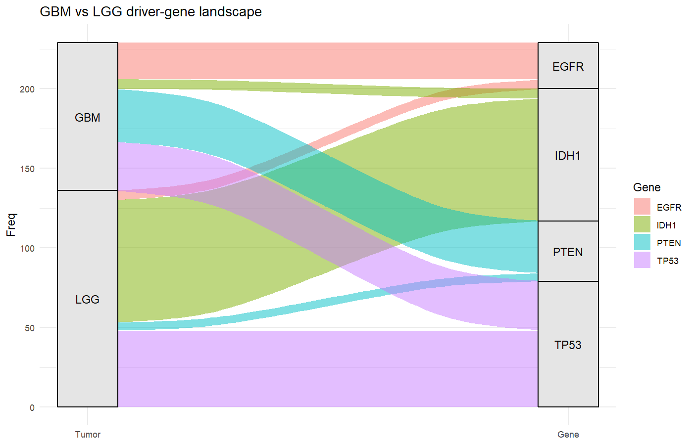

The radar plot summarizes major molecular differences between GBM and LGG.

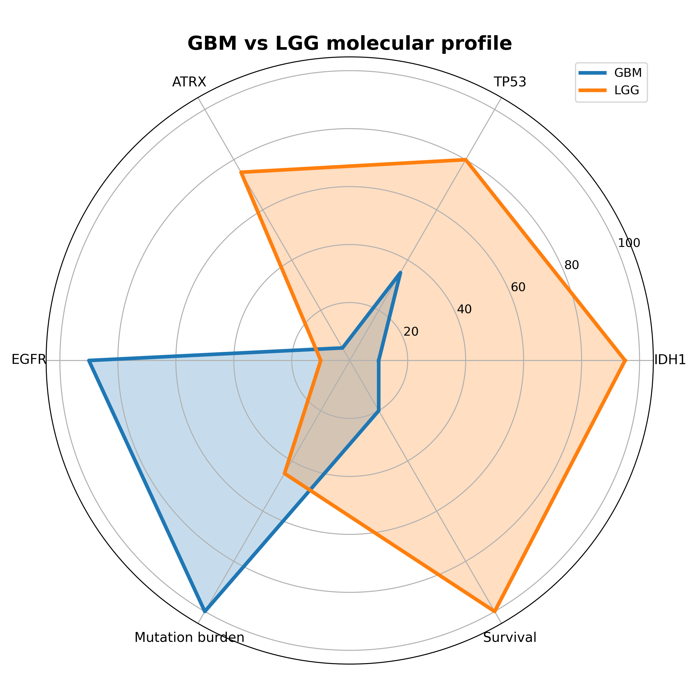

A simplified molecular evolution tree illustrates major glioma progression pathways.

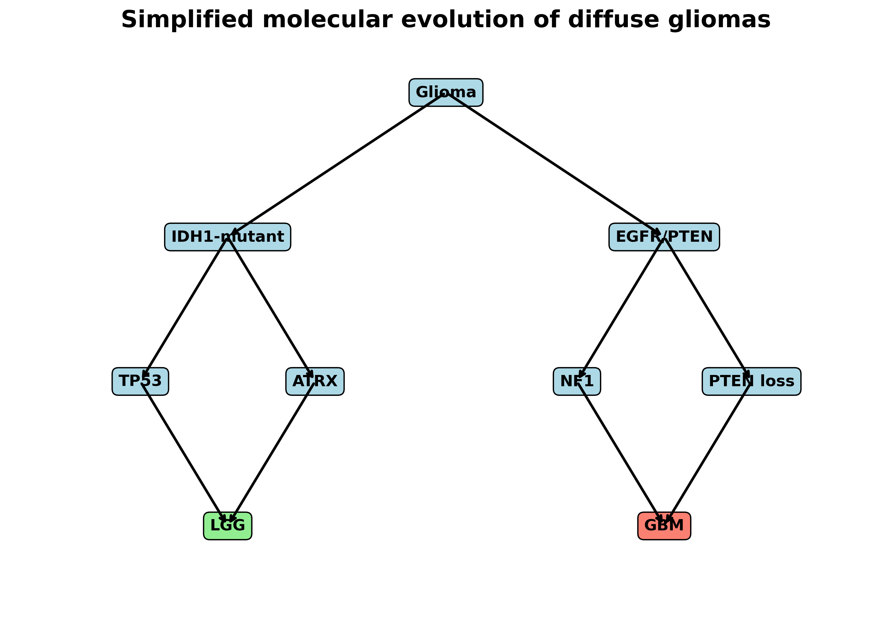

---

## Project Structure

```text
glioma-multiomics-landscape/
│
├── figures/
│   ├── oncoplot_maftools_gbm.png
│   ├── oncoplot_maftools_lgg.png
│   ├── co_oncoplot_gbm_lgg.png
│   ├── kaplan_meier_gbm_vs_lgg.png
│   ├── kaplan_meier_idh1.png
│   ├── mutual_exclusivity_lgg.png
│   ├── chord_comutation.png
│   ├── volcano_gbm_lgg.png
│   ├── top_de_genes_barplot.png
│   ├── rainfall_gbm.png
│   ├── waterfall_mutation_burden.png
│   └── alluvial_gbm_lgg.png
│
├── results/
│   └── tables/
│       ├── tcga_gbm_mutations.tsv
│       ├── tcga_lgg_mutations.tsv
│       ├── tcga_survival.tsv
│       ├── idh1_status.tsv
│       ├── gbm_vs_lgg_deseq2.tsv
│       └── mutation_comparison_gbm_lgg.tsv
│
├── scripts/
│   ├── oncoplot_maftools_gbm.R
│   ├── oncoplot_maftools_lgg.R
│   ├── kaplan_meier_gbm_lgg.R
│   ├── kaplan_meier_idh1.R
│   ├── mutual_exclusivity_lgg.R
│   ├── chord_comutation.R
│   ├── volcano_gbm_lgg.py
│   ├── waterfall_mutation_burden.py
│   └── alluvial_glioma.R
│
└── README.md
```

---

## Technologies Used

* Python
* R
* pandas
* matplotlib
* DESeq2
* maftools
* survival
* circlize
* ggplot2
* ggalluvial
* TCGA / GDC data

---

## Interpretation

The results support the strong molecular separation between GBM and LGG. LGG is primarily associated with IDH1-driven biology and improved survival, while GBM is associated with EGFR/PTEN alterations, higher aggressiveness, and poorer prognosis.

These findings are consistent with the modern molecular classification of diffuse gliomas, where IDH mutation status is one of the most important diagnostic and prognostic markers.

---

## Limitations

* The analysis is based on publicly available TCGA data.
* Some visualizations are descriptive and exploratory.
* Experimental validation was not performed.
* Pathway enrichment analysis can be added in future work.

---

## Future Work

* Add GO, KEGG, and Reactome pathway enrichment analysis.
* Add external cohort validation.
* Build machine learning models to classify GBM vs LGG.
* Integrate methylation and copy-number alteration data.
* Create a combined publication-style multi-panel figure.

---

## Author

Agata Gabara
Glioma multi-omics analysis project
GitHub: [ag48665](https://github.com/ag48665)

```
```
